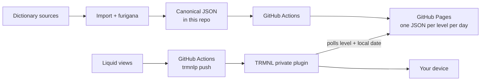

# Kotoba — JLPT Word of the Day

A TRMNL private plugin that shows one Japanese word a day, **with furigana
sitting over the kanji it belongs to**, at a JLPT level you choose.


This started as a rebuild of the official TRMNL Language Learning plugin. The
vocabulary method was good; what was missing was furigana over the kanji.
Kotoba adds that, and along the way deepens the vocabulary and pins each word
to a single JLPT-aligned level.

## What it does

- **Flash cards, not a word of the day** — the card changes every ten minutes,
  so each glance at the panel is a new word.
- **Furigana over the kanji only.** 取り除く shows と over 取 and のぞ over 除 —
  nothing over り or く, and no detached reading line.
- Choose **N5 through N1**. A level is *cumulative*: N3 draws on N5, N4 and N3
  together. The title bar lists the whole range and underlines the level this
  card came from.
- A concise English gloss and a natural Japanese example sentence.
- An optional English translation of the example, off by default.
- Cards come from a deterministic shuffled rotation, so words do not repeat
  until you have worked through the level.
- 8,289 words, 89% of them with an example sentence.

No server, no database, no account, no analytics, no paid API, no LLM in the
loop, and nothing scraped at runtime.

### The other layouts

| Half horizontal | Half vertical | Quadrant |
| --- | --- | --- |
|  |  |  |

Kana-only words get no ruby at all, and the optional translation sits quietly
under the Japanese:

| Kana only | With the translation switched on |
| --- | --- |
|  |  |

## How it works



Two things are worth understanding up front.

**TRMNL does not run Liquid from GitHub.** The private plugin holds its own
copy of the templates. This repository is the source of truth, and CI *pushes*
that truth to TRMNL with `trmnlp push`. Editing in the TRMNL browser editor
creates a second copy that will drift.

**The data is a static file, not an API.** Every level and *time slot* is
baked into its own tiny JSON document at build time. The plugin computes the
slot from the clock, so each poll fetches a different file — which is what
makes a file on a CDN behave like flash cards:

```
https://<owner>.github.io/<repo>/api/v1/card/n3/2911.json
```

The slot is `floor(now / 600) mod 4096` — a new card every ten minutes on a
28-day cycle. Payloads are around 700 bytes, the whole site is 12 MB across
20,480 files, and any slot can be opened in a browser when something looks
wrong.

There are no dates in the URL, so unlike a date-based API this one cannot run
out of coverage.

More detail in [docs/architecture.md](docs/architecture.md).

## Quick start

```sh
git clone https://github.com/simonjgreen/trmnl-japanese-vocab.git
cd trmnl-japanese-vocab
make setup
make check        # validate, test, build, render — no network, no Docker
```

`make help` lists everything.

### Local preview

```sh
make preview      # http://localhost:4567
```

This builds a short date range, serves it from a container named `data`, and
runs `trmnlp serve` against it. Requires Docker. `make preview-down` stops it.

To see the actual pixels:

```sh
make trmnlp-image     # trmnlp plus Japanese fonts, built once
make render-fixtures  # every fixture, every layout -> dist/renders/
```

The official `trmnl/trmnlp` image has no CJK fonts, so renders come out as
tofu boxes without that first step.

## Deploying it

The short version:

1. Fork or clone, then `python scripts/configure_repo.py` to point the plugin
   at your own Pages URL.
2. Push, and set Settings → Pages → Source to **GitHub Actions**.
3. `bin/trmnlp login && bin/trmnlp push` to create the plugin, then commit the
   `id:` it prints into `src/settings.yml`.
4. Add `TRMNL_API_KEY` as a repository Actions secret.
5. Merge to `main`. CI keeps both the data and the plugin up to date.

The plugin id is not a secret. The API key is.

Full instructions, including the manual ZIP path and rollback,
are in [docs/deployment.md](docs/deployment.md).

## Settings

| Setting | Default | What it does |
| ------- | ------- | ------------ |
| Learner level | `N5` | Cards are drawn from this level **and every easier one**. N5 is easiest, N1 hardest. |
| Show example translation | off | English under the Japanese example. Suppressed automatically in the smaller layouts. |
| Show rotation progress | off | Appends the card's position in the pool (`1840/3054`) after the level strip. |
| Data endpoint | your Pages URL | Where the daily JSON comes from. Under *Advanced*; leave it alone unless you host your own copy. No trailing slash. |

## About the vocabulary

**JLPT level assignments here are community estimates.** The Japan Foundation
and JEES stopped publishing official vocabulary lists in 2010. Every list in
circulation — including the one behind jisho.org, and the one used here —
descends from Jonathan Waller's lists and is, in his successors' own words,
"essentially an educated guess". Nothing in this project is official or
endorsed by anyone.

Sources, all redistributable:

| For | From | Licence |
| --- | ---- | ------- |
| JLPT levels | [yomitan-jlpt-vocab](https://github.com/stephenmk/yomitan-jlpt-vocab) → [Jonathan Waller](http://www.tanos.co.uk/jlpt/) | CC BY-SA 4.0 |
| Readings, glosses, examples | [JMdict](https://www.edrdg.org/wiki/index.php/JMdict-EDICT_Dictionary_Project) via [jmdict-simplified](https://github.com/scriptin/jmdict-simplified) | CC BY-SA 4.0 |
| Furigana segmentation | [JmdictFurigana](https://github.com/Doublevil/JmdictFurigana) | CC BY-SA 4.0 |
| Example sentences | [Tatoeba](https://tatoeba.org/) | CC BY 2.0 FR |

JMdict is the property of the Electronic Dictionary Research and Development
Group and is used in conformance with [the Group's
licence](https://www.edrdg.org/edrdg/licence.html).

**Licensing:** the code is MIT (`LICENSE`); the vocabulary data is CC BY-SA 4.0
and is *not* relicensed by it. Full attribution is in
[NOTICE.md](NOTICE.md), generated from `data/sources.yml`.

Background and rebuild instructions: [docs/data-sourcing.md](docs/data-sourcing.md).

## Commands

| Command | What it does |
| ------- | ------------ |
| `make setup` | Create the virtualenv and install dependencies |
| `make configure` | Point `settings.yml` at your own GitHub Pages URL |
| `make trmnlp-image` | Build the `trmnlp` image with Japanese fonts (needed for PNGs) |
| `make fetch-sources` | Download the upstream corpora (the only network step) |
| `make import` | Rebuild the canonical corpus from `data/raw` |
| `make import-demo` | Build the small committed demo corpus instead |
| `make validate` | Check corpus, provenance and schemas |
| `make notice` | Regenerate `NOTICE.md` from `data/sources.yml` |
| `make test` | Run the test suite |
| `make build-site` | Generate the full static site into `site/` |
| `make validate-site` | Check the generated API |
| `make manifest` | Summarise the generated build manifest |
| `make preview` | Local preview stack on :4567 |
| `make lint-plugin` | `trmnlp lint` |
| `make render` / `make render-fixtures` | Render the reference fixture / all of them, to HTML and PNG |
| `make render-html` | Every fixture to HTML only — no Docker or browser needed |
| `make render-devices` / `make render-devices-all` | Render on TRMNL's own panels / all 26 supported viewports |
| `make package` | Flat plugin ZIP in `dist/` |
| `make check` | Everything CI does, locally |
| `make clean` | Remove generated output |
| `make clean-raw` | Also remove the downloaded third-party corpora |

There is also a `kotoba` CLI:

```sh
kotoba inspect --level n3                      # what will the screen show?
kotoba align --surface 取り除く --reading とりのぞく
kotoba manifest
```

## Troubleshooting

**Blank or stale screen.** Almost always a 404 — an HTTP error cannot be drawn
as the empty state. Check `health.json` on your Pages site, then whether
today's file exists for your level, then whether `data_base_url` matches your
Pages URL. Walkthrough in
[docs/deployment.md](docs/deployment.md#diagnostics).

**"Vocabulary unavailable".** A payload arrived but carried no word. Open the
URL the plugin resolved and look at it.

**The wrong day's word.** The URL uses the *device's* local date. Check the
device's time zone.

**A word or reading looks wrong.** Open a
[vocabulary correction issue](.github/ISSUE_TEMPLATE/vocabulary-correction.yml)
— entry ID, current value, proposed value, evidence.

## Contributing

See [CONTRIBUTING.md](CONTRIBUTING.md). Corrections to readings, glosses and
furigana are especially welcome; level reassignments are more of a judgement
call. Security issues: [SECURITY.md](SECURITY.md).

## Design decisions

- [1. Static date-specific JSON on Pages](docs/adr/0001-static-pages-data-api.md)
- [2. Precomputed ruby segments](docs/adr/0002-precomputed-furigana-segments.md)
- [3. Deterministic shuffled cycles](docs/adr/0003-deterministic-cycle-selection.md)
- [4. GitHub as source of truth](docs/adr/0004-github-source-of-truth.md)
- [5. Where attribution lives](docs/adr/0005-attribution-placement.md)
- [6. Flash cards as one file per time slot](docs/adr/0006-flash-cards-per-time-slot.md)
