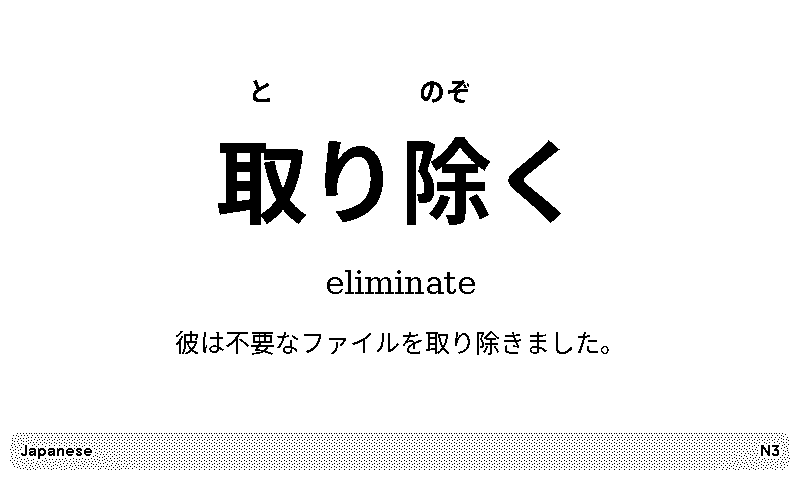
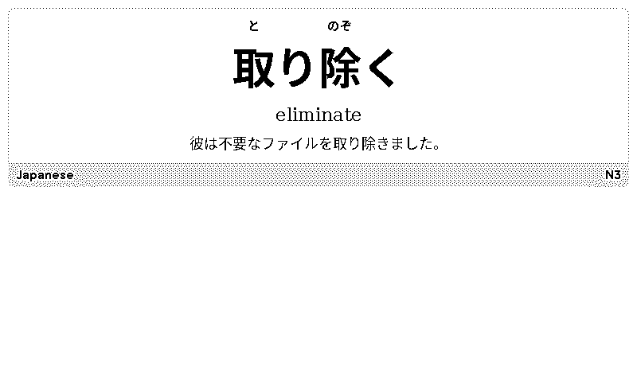
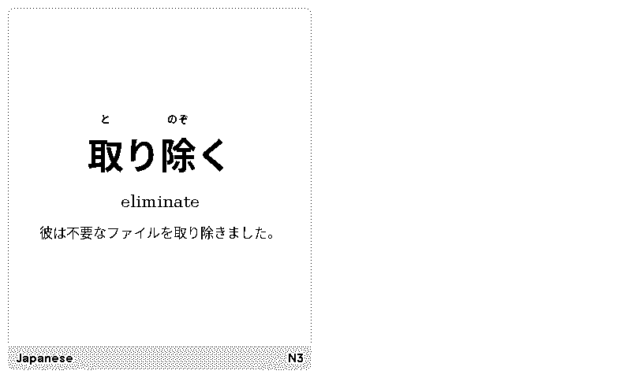
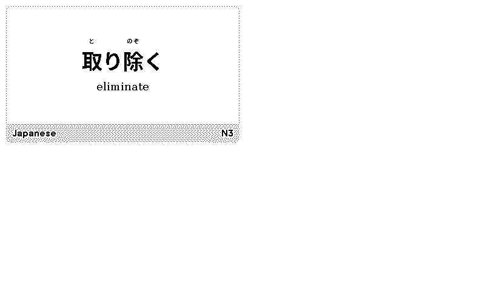
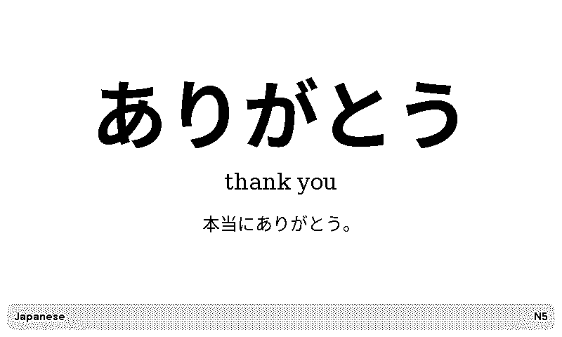
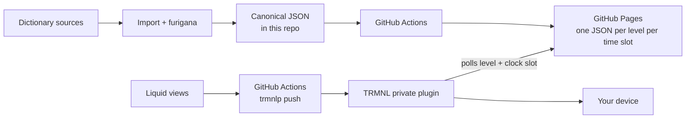

# Kotoba — JLPT Flash Cards

A TRMNL private plugin that turns your panel into a Japanese vocabulary flash
card, **with furigana sitting over the kanji it belongs to**, at a JLPT level
you choose.



This started as a rebuild of the official TRMNL Language Learning plugin. The
vocabulary method was good; what was missing was furigana over the kanji.
Kotoba adds that, deepens the vocabulary to 8,289 words, and lets you pick how
hard they are.

## What it does

- **A new card every ten minutes**, so each glance at the panel is a different
  word.
- **Furigana over the kanji only.** 取り除く shows と over 取 and のぞ over 除 —
  nothing over り or く, and no detached reading line.
- **Levels are cumulative.** Choose N3 and you get N5, N4 and N3 together. The
  title bar lists the range and underlines the level this card came from, so
  you always know where a word sits.
- A concise English gloss and a natural Japanese example sentence, with an
  optional English translation.
- Words don't repeat until you've worked through the whole level.
- 8,289 words across N5–N1, 89% with an example sentence.

No server, no database, no account, no analytics, no paid API, no LLM in the
loop, and nothing scraped at runtime. Just static files on GitHub Pages.

### The other layouts

| Half horizontal | Half vertical | Quadrant |
| --- | --- | --- |
|  |  |  |

Kana-only words get no ruby at all, and the optional translation sits quietly
under the Japanese:

| Kana only | With the translation switched on |
| --- | --- |
|  |  |

Works on the original 800×480 TRMNL and on TRMNL X. The card is designed in an
800×480 box and scaled to whatever panel it lands on, so it fits both without a
separate layout.

---

## Run it on your own TRMNL

Two routes. The first takes about five minutes and needs nothing but a TRMNL
account.

### Route 1 — use the plugin, borrow the data (5 minutes)

The vocabulary API is public and anonymous, so you can point at it without
deploying anything.

1. Get the plugin ZIP. Either clone and run `make package` (writes
   `dist/kotoba-plugin.zip`), or download the `renders` artefact from the most
   recent [CI run](../../actions/workflows/ci.yml) — the ZIP is inside it.
   It is a handful of Liquid files; nothing is compiled.
2. In TRMNL: **Plugins → Private Plugin → Import**, and upload the ZIP.
3. Open the plugin and set **Learner level**.
4. Check the **Data endpoint** under *Advanced* reads:
   ```
   https://simonjgreen.github.io/trmnl-japanese-vocab/api/v1
   ```
5. Add it to a playlist. Set the device's refresh rate to **15 minutes** so the
   card actually changes.

**The caveat:** that endpoint is a personal project on someone else's GitHub
Pages. It costs nothing to serve and there's no reason to take it down, but
there is no uptime promise. If you want to depend on it, use Route 2 — the
whole point of the design is that the data is just static files you can host
yourself.

### Route 2 — host the whole thing yourself

You get your own copy of the data, your own deploys, and the freedom to change
the corpus.

**You'll need:** a GitHub account, a TRMNL account and device, and Python 3.12.
Docker only if you want local previews or PNG renders.

```sh
# 1. Fork this repo on GitHub, then clone your fork
git clone https://github.com/<you>/trmnl-japanese-vocab.git
cd trmnl-japanese-vocab
make setup

# 2. Point the plugin at your own Pages URL (reads it from your git remote)
make configure

# 3. Check everything builds
make check
```

Then:

4. Commit and push.
5. **Settings → Pages → Source: GitHub Actions.** Not "deploy from a branch" —
   the site is generated, not committed.
6. Run the **Pages** workflow and wait for it to go green.
7. Delete the `id:` line from `src/settings.yml`. It is the upstream plugin's
   id, and it isn't yours — pushing with it still in place aims at someone
   else's plugin. (`make configure` reminds you of this.)
8. `bin/trmnlp login && bin/trmnlp push` — this creates the plugin and prints
   a new `id`. Commit that `id` into `src/settings.yml`.
9. Add `TRMNL_API_KEY` as a repository Actions secret.
10. Merge to `main`. From then on CI keeps both the data and the plugin
    current.

The plugin `id` is not a secret and belongs in the repo. The API key is, and
belongs in Actions secrets.

**You do not need to download any dictionary data.** The 8,289-word corpus is
committed. `make fetch-sources` and `make import` are only for rebuilding it
from upstream, and they pull ~135 MB.

Full instructions — the manual ZIP path, rollback, diagnostics — are in
[docs/deployment.md](docs/deployment.md).

### Settings

| Setting | Default | What it does |
| ------- | ------- | ------------ |
| Learner level | `N5` | Cards come from this level **and every easier one**. N5 is easiest, N1 hardest. |
| Show example translation | off | English under the Japanese example. Suppressed automatically in the smaller layouts. |
| Show rotation progress | off | Appends the card's position in the pool (`1840/3054`) after the level strip. |
| Data endpoint | your Pages URL | Where the cards come from. Under *Advanced*. No trailing slash. |

### Things worth knowing before you commit to it

- **Refresh rate.** TRMNL's free tier allows a 15-minute refresh, which is what
  this is tuned for. Faster needs TRMNL+; slower just means you see fewer cards
  a day, which is fine.
- **JLPT levels are community estimates**, not an official list. See
  [below](#about-the-vocabulary).
- **Battery.** A 15-minute refresh is more frequent than a typical TRMNL
  plugin, so expect shorter battery life than a once-a-day dashboard.
- **The corpus is opinionated.** One gloss per word, one example sentence. It
  is a reminder, not a dictionary.

---

## How it works



Two things are worth understanding up front.

**TRMNL does not run Liquid from GitHub.** The private plugin holds its own
copy of the templates. This repository is the source of truth, and CI *pushes*
that truth with `trmnlp push`. Editing in the TRMNL browser editor creates a
second copy that will drift.

**The data is a pile of static files, not an API.** Every level and *time slot*
is baked into its own tiny JSON document at build time. The plugin computes the
slot from the clock, so each poll fetches a different file:

```
https://<owner>.github.io/<repo>/api/v1/card/n3/2911.json

slot = floor(now / 600) mod 4096
```

A new card every ten minutes on a 28-day cycle. Payloads are ~700 bytes, the
whole site is 12 MB across 20,480 files, and any slot can be opened in a
browser when something looks wrong.

This is deliberate rather than clever. TRMNL skips rendering when a polled
payload hasn't changed, so choosing the card *in the template* leaves the
screen frozen — the card has to differ in the data. A useful side effect is
that there are no dates in the URL, so unlike a date-based API this one cannot
run out of coverage.

More detail in [docs/architecture.md](docs/architecture.md), and the reasoning
in [ADR 6](docs/adr/0006-flash-cards-per-time-slot.md).

## About the vocabulary

**JLPT level assignments here are community estimates.** The Japan Foundation
and JEES stopped publishing official vocabulary lists in 2010. Every list in
circulation — including the one behind jisho.org, and the one used here —
descends from Jonathan Waller's lists and is, in his successors' own words,
"essentially an educated guess". Nothing in this project is official or
endorsed by anyone.

Sources, all redistributable:

| For | From | Licence |
| --- | ---- | ------- |
| JLPT levels | [yomitan-jlpt-vocab](https://github.com/stephenmk/yomitan-jlpt-vocab) → [Jonathan Waller](http://www.tanos.co.uk/jlpt/) | CC BY-SA 4.0 |
| Readings, glosses, examples | [JMdict](https://www.edrdg.org/wiki/index.php/JMdict-EDICT_Dictionary_Project) via [jmdict-simplified](https://github.com/scriptin/jmdict-simplified) | CC BY-SA 4.0 |
| Furigana segmentation | [JmdictFurigana](https://github.com/Doublevil/JmdictFurigana) | CC BY-SA 4.0 |
| Example sentences | [Tatoeba](https://tatoeba.org/) | CC BY 2.0 FR |

JMdict is the property of the Electronic Dictionary Research and Development
Group and is used in conformance with [the Group's
licence](https://www.edrdg.org/edrdg/licence.html).

**Licensing:** the code is MIT (`LICENSE`); the vocabulary data is CC BY-SA 4.0
and is *not* relicensed by it. If you fork this, you inherit both. Full
attribution is in [NOTICE.md](NOTICE.md), generated from `data/sources.yml`.

Background and rebuild instructions: [docs/data-sourcing.md](docs/data-sourcing.md).

## Development

```sh
make check        # validate, test, build, render — no network, no Docker
make preview      # local preview stack on http://localhost:4567 (needs Docker)
```

To see actual pixels rather than HTML:

```sh
make trmnlp-image     # trmnlp plus Japanese fonts, built once
make render-fixtures  # every fixture, every layout -> dist/renders/
make render-devices   # the same card on TRMNL's own panel sizes
```

The official `trmnl/trmnlp` image ships no CJK fonts, so renders come out as
tofu boxes without that first step.

Changing the Liquid or CSS? `trmnlp lint` caps how many `font-size`, `margin`,
`padding` and similar declarations the markup may contain — six in total,
counted as raw substrings including comments. That's why sizes are CSS custom
properties. Run `make lint-plugin` before pushing, and read
[docs/visual-design.md](docs/visual-design.md).

<details>
<summary><strong>All commands</strong></summary>

| Command | What it does |
| ------- | ------------ |
| `make setup` | Create the virtualenv and install dependencies |
| `make configure` | Point `settings.yml` at your own GitHub Pages URL |
| `make trmnlp-image` | Build the `trmnlp` image with Japanese fonts (needed for PNGs) |
| `make fetch-sources` | Download the upstream corpora (~135 MB; the only network step) |
| `make import` | Rebuild the canonical corpus from `data/raw` |
| `make import-demo` | Build the small committed demo corpus instead |
| `make validate` | Check corpus, provenance and schemas |
| `make notice` | Regenerate `NOTICE.md` from `data/sources.yml` |
| `make test` | Run the test suite |
| `make build-site` | Generate the full static site into `site/` |
| `make validate-site` | Check the generated API |
| `make manifest` | Summarise the generated build manifest |
| `make preview` | Local preview stack on :4567 |
| `make lint-plugin` | `trmnlp lint` |
| `make render` / `make render-fixtures` | Render the reference fixture / all of them, to HTML and PNG |
| `make render-html` | Every fixture to HTML only — no Docker or browser needed |
| `make render-devices` / `make render-devices-all` | Render on TRMNL's own panels / every viewport in the device table |
| `make package` | Flat plugin ZIP in `dist/` |
| `make check` | Everything CI does, locally |
| `make clean` | Remove generated output |
| `make clean-raw` | Also remove the downloaded third-party corpora |

There is also a `kotoba` CLI:

```sh
kotoba inspect --level n3                       # the card on screen right now
kotoba inspect --level n3 --slot 0              # a specific slot
kotoba align --surface 取り除く --reading とりのぞく
kotoba manifest
```

</details>

## Troubleshooting

**Stuck on one word.** Check the plugin's **Activity** log in TRMNL. `Render
skipped — no change in data` means it is being served an unchanging payload.
Confirm the polling URL still contains the `divided_by` / `modulo` expression,
and that consecutive slot files differ.

**Blank screen.** Almost always a 404 — an HTTP error cannot be drawn as the
empty state. Check `health.json` on your Pages site, then whether the slot the
plugin is asking for exists, then whether the data endpoint matches your Pages
URL. Walkthrough in [docs/deployment.md](docs/deployment.md#diagnostics).

**"Vocabulary unavailable".** A payload arrived but carried no card. Open the
URL the plugin resolved and look at it.

**A word or reading looks wrong.** Open a
[vocabulary correction issue](.github/ISSUE_TEMPLATE/vocabulary-correction.yml)
— entry ID, current value, proposed value, evidence.

## Contributing

See [CONTRIBUTING.md](CONTRIBUTING.md). Corrections to readings, glosses and
furigana are especially welcome; level reassignments are more of a judgement
call. Security issues: [SECURITY.md](SECURITY.md).

## Design decisions

- [1. Static JSON on Pages instead of a server](docs/adr/0001-static-pages-data-api.md)
- [2. Precomputed ruby segments](docs/adr/0002-precomputed-furigana-segments.md)
- [3. Deterministic shuffled cycles](docs/adr/0003-deterministic-cycle-selection.md)
- [4. GitHub as source of truth](docs/adr/0004-github-source-of-truth.md)
- [5. Where attribution lives](docs/adr/0005-attribution-placement.md)
- [6. Flash cards as one file per time slot](docs/adr/0006-flash-cards-per-time-slot.md)
