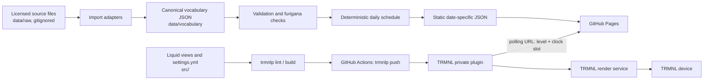

# Architecture

## Components



Two independent pipelines meet only at the device:

- **Data** is imported locally, reviewed, committed, then built and deployed
  to GitHub Pages by `pages.yml`.
- **Plugin code** is linted and pushed to TRMNL by `trmnl.yml`.

A failure in one leaves the other's last good state intact.

## Why the plugin is not "Liquid executed from GitHub"

TRMNL does not fetch Liquid from a repository at render time. The private
plugin holds its own copy of the templates and settings, which is why they have
to be *pushed*. GitHub is the source of truth (see
[ADR 4](adr/0004-github-source-of-truth.md)); `trmnlp push` is how that truth
reaches TRMNL.

## Data flow, stage by stage

1. **Fetch** — `scripts/fetch_sources.py` downloads three upstream files into
   `data/raw`. This is the only network step and it never runs in CI.
2. **Import** — `kotoba import` reads them through an adapter, normalises,
   deduplicates, resolves furigana, applies overrides, and writes
   `data/vocabulary/n{5..1}.json` stable-sorted by ID.
3. **Review** — the canonical diff is inspected by a human and committed.
   Anything the aligner could not resolve is written `disabled` and listed in
   `data/review/furigana-review.md`.
4. **Validate** — `kotoba validate` checks schemas, provenance, furigana
   consistency and length limits.
5. **Build** — `kotoba build-site` writes one card per level per time slot,
   plus a manifest, a health file and an index page.
6. **Deploy** — `pages.yml` uploads the site; `trmnl.yml` pushes the plugin.

CI never reaches out to a vocabulary source, so a build is reproducible and an
upstream change can never alter the corpus without a reviewed commit.

## The static API contract

```
https://<owner>.github.io/<repo>/api/v1/card/<level>/<slot>.json
```

The plugin composes this from `data_base_url`, `jlpt_level` and a slot index
derived from the clock:

```liquid
{{ data_base_url }}/card/{{ jlpt_level }}/{{ "now" | date: "%s" | divided_by: 600 | modulo: 4096 }}.json
```

**Why the slot is in the URL and not in the template.** TRMNL hashes the
polled payload and skips rendering when it is unchanged — its activity log
says `Render skipped — no change in data`. A card chosen in Liquid from an
unchanging payload can therefore never change on screen. Putting the slot in
the path makes each poll fetch different bytes. See
[ADR 6](adr/0006-flash-cards-per-time-slot.md).

The slot length (600s) must not exceed TRMNL's render interval (15 minutes),
or two renders could land in the same slot and the screen would freeze. Both
constants are duplicated in `src/settings.yml` because a Liquid modulo needs
literals; a test asserts they match `config/build.yml`.

There is no date anywhere in the path, so the API cannot run out of coverage —
the failure mode where a device asks for a date that was never generated
simply does not exist.

A payload is one card:

```json
{
  "schema_version": "3.0",
  "level": "n3",
  "level_display": "N3",
  "dataset_version": "2026.08.1+1a2b3c4d",
  "selection_version": "1",
  "slot": { "index": 2911, "seconds": 600, "count": 4096 },
  "sequence": { "position": 1840, "pool": 3054 },
  "word": {
    "id": "jlpt-waller:1361140-4a1b2c",
    "surface": "拾う",
    "reading": "ひろう",
    "ruby_segments": [
      { "base": "拾", "reading": "ひろ" },
      { "base": "う", "reading": null }
    ],
    "display_gloss": "to pick up",
    "level": "N4",
    "example": {
      "ja": "床からペンを拾って下さい。",
      "en": "Please pick up the pen from the floor."
    },
    "display": { "word_size": "short", "example_size": "normal" }
  }
}
```

`word.level` differs from `level_display` because a level is cumulative: an N3
learner draws on N5 and N4 too. The title bar lists the range and underlines
the card's own level.

Constraints: UTF-8, Japanese left unescaped so a human can read the file,
minified in the deployed site, no HTML anywhere, hard 8 KB ceiling. Real
payloads are around 700 bytes.

Also served, for inspection and monitoring only:

| Path | Purpose |
| ---- | ------- |
| `api/v1/manifest.json` | dataset version, commit, counts, slot configuration |
| `health.json` | small operational summary |
| `api/v1/card/<level>/sample.json` | one card, pretty-printed |
| `index.html` | landing page and public attribution surface |

## Sizing decided at build time

`word_size` and `example_size` are computed during the build from an estimated
display width, not from byte length: kana and kanji count as one full-width
unit, Latin characters as roughly half. A segment contributes whichever of its
base or its ruby is wider, so a single kanji carrying a five-kana reading
(承る / うけたまわる) is correctly treated as wide. The renderer then only has to
map a class name to a size.

## Failure modes

| What breaks | What happens |
| ----------- | ------------ |
| Pages build fails | The previous deployment stays live; existing dates keep working. |
| Weekly schedule stops | Nothing breaks. Slot URLs have no dates, so coverage never lapses; only the rotation stops advancing, and after 28 days the sequence repeats. |
| TRMNL push fails | The installed plugin is unchanged. Data is unaffected. |
| A bad vocabulary entry | Validation fails the build. A partial site is never published. |
| A slot file is missing | A build fault, not a scheduling one — validation checks every slot the URL can request exists. |

The plugin deliberately does not fall back to a different date. A wrong word
presented as today's word is worse than a visible failure.
