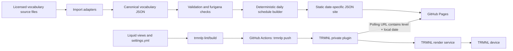

/goal

Build a production-ready, repository-contained TRMNL private plugin called **Kotoba — JLPT Word of the Day**. Implement the repository, tests, build pipeline, local preview workflow, deployment workflows, documentation and a small clearly-labelled demonstration dataset. Do not merely restate this specification or produce a design proposal: create the working codebase described here.

The result must reproduce the visual intent of the supplied TRMNL Language Learning reference: one large Japanese word, an English gloss beneath it, a Japanese example sentence beneath that, and a compact title bar at the bottom. The material improvement is that the target word must display **furigana directly above the kanji**, using proper HTML ruby markup. A user must be able to choose a learner level from **JLPT N5 through N1** in the TRMNL plugin settings.

Use British English in documentation and comments. Make reasonable implementation decisions without stopping for clarification. Record any materially different decision in an ADR. Do not introduce an always-on application server, database, account system, analytics service, paid API, LLM dependency, or runtime scraper.

---

# 1. Product outcome

Create a daily Japanese vocabulary screen for TRMNL with these default behaviours:

1. The learner selects one target level: **N5, N4, N3, N2 or N1**.
2. The screen shows one deterministic word for that local calendar day and level.
3. The word is rendered prominently in Japanese.
4. Furigana is shown only over the kanji-bearing portions of the target word, not as one detached reading line and not over kana that is already readable.
5. A concise English gloss appears below the word.
6. A natural Japanese example sentence appears below the gloss.
7. The English translation of the example sentence is available as an optional setting and is off by default.
8. The title bar says **Japanese** and shows the selected JLPT level as the instance label.
9. A force refresh on the same day produces the same word. The next local day produces the next word in a deterministic shuffled rotation.
10. The repository is the source of truth for plugin code, data-processing code and vocab data, subject to the licence of the supplied vocabulary source.

Working repository name: `trmnl-kotoba`.

Working plugin name: `Kotoba — JLPT Word of the Day`.

---

# 2. Important platform interpretation

Do **not** model this as TRMNL executing Liquid templates directly from GitHub at screen-render time.

The intended arrangement is:

- GitHub is the source of truth.
- `trmnlp` develops, validates and pushes the private-plugin definition from the repository into TRMNL.
- A GitHub Action deploys plugin changes to TRMNL after merge to `main`.
- GitHub Pages serves tiny, date-specific JSON payloads generated from the vocabulary corpus.
- The installed TRMNL private plugin polls the appropriate GitHub Pages JSON URL using its selected JLPT level and the user's local date.

The modern TRMNL GitHub Sync integration may be documented as an optional convenience, but it is **not** the primary deployment path because GitHub-to-TRMNL imports through that integration are currently manual. The code-first primary path is `trmnlp push` from GitHub Actions.

Do not create two competing sources of truth. Once bootstrapped, changes should be made in GitHub, reviewed, merged, and deployed. The TRMNL browser editor may be used for debugging, but changes made there must be pulled back and committed immediately or discarded.

---

# 3. Architecture summary

Use a static, serverless-at-runtime architecture:



## 3.1 Chosen design

Build a rolling static data site in GitHub Actions. For every supported date and every level, emit one small JSON document:

```text
https://GITHUB_OWNER.github.io/GITHUB_REPO/api/v1/daily/n5/2026-08-09.json
https://GITHUB_OWNER.github.io/GITHUB_REPO/api/v1/daily/n4/2026-08-09.json
https://GITHUB_OWNER.github.io/GITHUB_REPO/api/v1/daily/n3/2026-08-09.json
https://GITHUB_OWNER.github.io/GITHUB_REPO/api/v1/daily/n2/2026-08-09.json
https://GITHUB_OWNER.github.io/GITHUB_REPO/api/v1/daily/n1/2026-08-09.json
```

The TRMNL plugin's polling URL is dynamically generated from:

- the `data_base_url` custom field;
- the `jlpt_level` custom field; and
- the current time shifted by `trmnl.user.utc_offset`, then formatted as `YYYY-MM-DD`.

## 3.2 Why this design

This is preferred over polling a complete vocabulary list or running selection in Liquid because:

- each TRMNL payload stays very small;
- the payload itself changes each day, so TRMNL has a reason to generate a new screen;
- no large corpus is passed through the private-plugin merge variables;
- no random behaviour occurs in Liquid;
- no always-on server or database is required;
- the exact payload for a date can be inspected in a browser;
- date-specific URLs are naturally cacheable;
- selection is deterministic and testable;
- the design does not depend on the newer TRMNL Serverless runtime for a simple use case.

TRMNL Serverless may be described in an ADR as the principal rejected alternative. Do not implement it in the initial version.

---

# 4. Scope

## 4.1 In scope

- A TRMNL polling private plugin.
- Full, half-horizontal, half-vertical and quadrant layouts.
- JLPT level selection, N5 through N1.
- Proper furigana over the target word's kanji.
- English gloss.
- Japanese example sentence.
- Optional English example translation.
- Optional rotation progress.
- Source-neutral vocabulary import framework.
- Canonical JSON data model.
- Data provenance and licence metadata.
- Deterministic daily selection without repetition inside a complete cycle.
- Static JSON generation for GitHub Pages.
- Local development using `trmnlp`.
- Automated tests and visual render artefacts.
- GitHub Actions for CI, Pages deployment and TRMNL deployment.
- A manual ZIP packaging path as a fallback installation method.
- Thorough README and deployment documentation.

## 4.2 Explicitly out of scope for version 1

- User accounts or per-user learning history.
- Spaced repetition.
- “Known”, “learning” or “suspend” actions.
- Audio or pronunciation playback.
- Pitch accent display.
- Romaji.
- Furigana over the example sentence.
- Grammar explanations.
- Multiple words per screen.
- Runtime calls to dictionary, translation, LLM or example-sentence APIs.
- Scraping websites.
- A writable backend, database, worker or cron service outside GitHub Actions.
- An official claim that a word belongs to a JLPT level.
- Publishing as a public TRMNL integration or Recipe; the code should remain capable of that later.

---

# 5. JLPT terminology and semantics

The current JLPT does not publish an official vocabulary/kanji/grammar specification. Therefore:

- call the data **JLPT-aligned**, **JLPT-levelled**, or **community-estimated** in documentation;
- never call the corpus an official JLPT vocabulary list;
- never imply endorsement by the Japan Foundation or JEES;
- keep the source's own level assignment and provenance;
- expose N5 as beginner/easiest and N1 as advanced/hardest.

For version 1, selecting a level means **words assigned to that exact target level only**. An N3 selection does not silently mix N5 and N4 material into the rotation. This keeps the setting unambiguous and prevents easier lists from dominating. Design the data/filter layer so a future `target_only` versus `target_and_easier` setting could be added without changing the canonical data model, but do not add that control now.

---

# 6. User experience

## 6.1 Plugin settings

Expose these fields:

### Learner level

- Key: `jlpt_level`
- Type: select
- Required
- Default: `n5`
- Options:
  - `N5 — beginner` -> `n5`
  - `N4 — elementary` -> `n4`
  - `N3 — intermediate` -> `n3`
  - `N2 — upper-intermediate` -> `n2`
  - `N1 — advanced` -> `n1`

### Show example translation

- Key: `show_example_translation`
- Type: boolean
- Default: `false`
- The Japanese example is always shown in the full view when available.
- The English example translation is shown only when this setting is true and space permits.
- It is automatically suppressed in the quadrant and half-vertical layouts.

### Show rotation progress

- Key: `show_rotation_progress`
- Type: boolean
- Default: `false`
- When true, the title-bar instance may show `N3 · 42/650` rather than just `N3`.
- Keep this off by default to preserve the sparse appearance of the reference design.

### Data endpoint

- Key: `data_base_url`
- Type: URL
- Required
- Group: `Advanced`
- Default placeholder: `https://GITHUB_OWNER.github.io/GITHUB_REPO/api/v1`
- No trailing slash.
- A repository configuration script must replace the placeholder automatically when the GitHub remote can be identified.

## 6.2 Daily behaviour

- The selected word changes at local midnight as interpreted from TRMNL's current timestamp plus the user's current UTC offset.
- The same level and local date always resolve to the same static JSON path.
- A refresh on the same day is idempotent.
- Changing learner level changes the requested URL and displayed word.
- The plugin refresh interval is once per day (`1440` minutes).
- The generated site must include enough past and future date coverage that delayed GitHub schedules cannot break the plugin.

## 6.3 Full-screen visual design

The baseline target is the original 800 × 480 TRMNL display.

The visual order is:

1. Large Japanese target word, centred horizontally.
2. Furigana immediately above the relevant kanji portions.
3. English gloss, centred beneath the word.
4. Japanese example sentence, centred beneath the gloss.
5. Optional English example translation in smaller type.
6. Standard TRMNL title bar at the bottom.

The screen must feel intentionally sparse. Do not add cards, boxes, decorative borders, gradients, progress bars, illustrations or unnecessary metadata.

### Target word

- It is the dominant element.
- Keep it on one line.
- Use a Japanese-capable sans-serif fallback stack.
- Set `lang="ja"` on Japanese text containers so the renderer selects Japanese glyph variants where possible.
- Use proper `<ruby>`, `<rb>` and `<rt>` markup.
- Furigana should be approximately 24–30% of the base character size.
- Furigana must be legible but subordinate.
- Reserve enough vertical space that ruby text never collides with the top edge.
- No separate romaji or kana reading line.

### English gloss

- One concise display gloss.
- Usually one line; permit two only for unusually long material.
- Do not dump every dictionary sense onto the screen.

### Example sentence

- Japanese is the primary example.
- It may use one or two lines in the full layout.
- Use balanced centring and generous whitespace.
- Wrap in typographic quotation marks only if it does not make fitting worse; be consistent across layouts.
- The optional English translation must remain visually secondary.

### Title bar

Use the standard TRMNL `title_bar` as a sibling of `layout`.

- Title: `Japanese`
- Instance: selected level, e.g. `N3`
- With optional progress: `N3 · 42/650`
- An icon is optional. If included, it must be a small original inline SVG or simple local mark; do not depend on a remote image.

## 6.4 Responsive layouts

Implement all four TRMNL view files.

### Full

Show:

- word with furigana;
- gloss;
- Japanese example;
- optional English translation;
- title bar.

### Half horizontal

Show:

- word with furigana;
- gloss;
- Japanese example, one line or tightly clamped;
- no English example translation;
- compact title bar.

### Half vertical

Show:

- word with furigana;
- gloss;
- Japanese example only when it fits cleanly;
- no English translation;
- compact title bar.

### Quadrant

Show:

- word with furigana;
- gloss;
- no example sentence unless a very short sentence demonstrably fits without compromising the word;
- compact title bar.

The target word must remain the dominant element in every layout.

---

# 7. Repository layout

Create approximately this structure. Small justified deviations are acceptable, but preserve the separation between TRMNL plugin code, canonical data, Python build tooling, generated site output and documentation.

```text
.
├── README.md
├── LICENSE
├── NOTICE.md
├── CONTRIBUTING.md
├── SECURITY.md
├── Makefile
├── pyproject.toml
├── uv.lock
├── .gitignore
├── .editorconfig
├── .trmnlp.yml
├── compose.yml
├── bin/
│   └── trmnlp
├── src/
│   ├── settings.yml
│   ├── shared.liquid
│   ├── full.liquid
│   ├── half_horizontal.liquid
│   ├── half_vertical.liquid
│   └── quadrant.liquid
├── kotoba/
│   ├── __init__.py
│   ├── cli.py
│   ├── models.py
│   ├── normalise.py
│   ├── furigana.py
│   ├── selection.py
│   ├── site_builder.py
│   ├── validation.py
│   ├── provenance.py
│   └── sources/
│       ├── __init__.py
│       ├── base.py
│       ├── csv_source.py
│       └── json_source.py
├── config/
│   ├── build.yml
│   ├── sources.example.yml
│   └── selection.yml
├── data/
│   ├── VERSION
│   ├── sources.yml
│   ├── vocabulary/
│   │   ├── n5.json
│   │   ├── n4.json
│   │   ├── n3.json
│   │   ├── n2.json
│   │   └── n1.json
│   ├── overrides/
│   │   └── furigana.yml
│   ├── review/
│   │   └── .gitkeep
│   └── demo/
│       └── README.md
├── schemas/
│   ├── vocabulary-entry.schema.json
│   ├── vocabulary-file.schema.json
│   ├── daily-payload.schema.json
│   └── sources.schema.json
├── scripts/
│   ├── configure_repo.py
│   ├── package_plugin.py
│   └── render_fixtures.py
├── tests/
│   ├── fixtures/
│   │   ├── full_reference.json
│   │   ├── kana_only.json
│   │   ├── compound_reading.json
│   │   ├── irregular_reading.json
│   │   ├── long_word.json
│   │   ├── long_example.json
│   │   └── missing_optional_fields.json
│   ├── test_furigana.py
│   ├── test_selection.py
│   ├── test_validation.py
│   ├── test_site_builder.py
│   ├── test_payload_schema.py
│   └── test_configuration.py
├── docs/
│   ├── architecture.md
│   ├── data-sourcing.md
│   ├── deployment.md
│   ├── visual-design.md
│   └── adr/
│       ├── 0001-static-pages-data-api.md
│       ├── 0002-precomputed-furigana-segments.md
│       ├── 0003-deterministic-cycle-selection.md
│       └── 0004-github-source-of-truth.md
├── site/                       # generated; gitignored
├── dist/                       # generated; gitignored
└── .github/
    ├── workflows/
    │   ├── ci.yml
    │   ├── pages.yml
    │   └── trmnl.yml
    ├── dependabot.yml
    └── ISSUE_TEMPLATE/
        └── vocabulary-correction.yml
```

Do not commit generated `site/`, `_build/` or `dist/` output.

---

# 8. Canonical vocabulary data model

Use UTF-8 JSON, normalised to Unicode NFC. Keep one pretty-printed, stable-sorted JSON array per target level. The build must sort records by stable `id` before writing canonical files.

A canonical entry must have this logical shape:

```json
{
  "id": "demo:taberu",
  "surface": "食べる",
  "reading": "たべる",
  "ruby_segments": [
    { "base": "食", "reading": "た" },
    { "base": "べる", "reading": null }
  ],
  "glosses": [
    "to eat"
  ],
  "display_gloss": "eat",
  "part_of_speech": [
    "verb"
  ],
  "jlpt": {
    "level": "N5",
    "source_id": "demo",
    "confidence": "source-assigned"
  },
  "example": {
    "ja": "私は毎朝パンを食べます。",
    "en": "I eat bread every morning.",
    "focus_form": "食べます",
    "source_ref": "demo"
  },
  "source_refs": [
    {
      "source_id": "demo",
      "source_entry_id": "taberu"
    }
  ],
  "status": "active",
  "notes": null
}
```

## 8.1 Required entry fields

- `id`: stable namespaced identifier.
- `surface`: dictionary form shown on screen.
- `reading`: complete kana reading.
- `ruby_segments`: final reviewed segmentation used by the renderer.
- `glosses`: one or more source glosses.
- `display_gloss`: concise screen-safe gloss.
- `jlpt.level`: one of `N5`, `N4`, `N3`, `N2`, `N1`.
- `jlpt.source_id`: the source that supplied the level assignment.
- `source_refs`: at least one provenance reference.
- `status`: `active` or `disabled`.

## 8.2 Optional entry fields

- `part_of_speech`.
- `example`.
- `notes`.
- source confidence or manual-review metadata.

Production data should have a Japanese example sentence, but the renderer must degrade gracefully if an entry temporarily lacks one.

## 8.3 Stable identifiers

Prefer an identifier supplied by the vocabulary source. Namespace it, for example `jmdict:1234567` or `source-name:abc123`.

If a source has no stable identifier, derive one from a cryptographic digest of immutable lexical identity fields such as:

```text
source_id + NUL + surface + NUL + reading + NUL + source_level
```

Do not change an ID merely because a gloss, example sentence or note changes.

## 8.4 Display gloss rules

- Keep `glosses` faithful to the source.
- Make `display_gloss` intentionally concise.
- Recommended maximum: 60 characters.
- Hard maximum: 90 characters.
- Do not concatenate a long dictionary sense list into the display field.
- Preserve proper capitalisation where semantically necessary; otherwise favour a simple lower-case learning gloss.

## 8.5 Example sentence rules

- Japanese recommended maximum: 50 Japanese-width characters.
- Japanese hard maximum: 80 characters.
- English recommended maximum: 100 characters.
- English hard maximum: 160 characters.
- Sentences must be licensed for redistribution.
- Record sentence provenance separately if it comes from a different source.
- `focus_form` may contain the conjugated form used in the sentence and is for validation only.
- Do not render `focus_form` as extra UI.

---

# 9. Furigana representation and generation

## 9.1 Core rule

The renderer must never attempt to infer furigana from the complete reading at screen-render time. The final ruby segmentation is precomputed and validated during ingestion/build.

For the reference word:

```text
取り除く
とりのぞく
```

The canonical segments must be:

```json
[
  { "base": "取", "reading": "と" },
  { "base": "り", "reading": null },
  { "base": "除", "reading": "のぞ" },
  { "base": "く", "reading": null }
]
```

The intended markup is semantically equivalent to:

```html
<ruby><rb>取</rb><rt>と</rt></ruby>り<ruby><rb>除</rb><rt>のぞ</rt></ruby>く
```

## 9.2 Grouping rules

- A segment with a non-null `reading` is rendered as ruby.
- A segment with a null `reading` is rendered as plain text.
- Kana-only words contain one or more plain segments and no empty `<rt>` elements.
- Contiguous kanji may be grouped when the reading cannot be reliably divided by character.
- Irregular readings such as `今日` -> `きょう` should be represented as one grouped ruby segment rather than guessed per-kanji readings.
- Okurigana remains plain beside the relevant ruby group.
- The concatenation of every `base` must exactly equal `surface`.
- The reconstructed reading must equal `reading` after normalising kana.

## 9.3 Conservative automatic aligner

Implement a conservative aligner for sources that provide `surface` and a complete kana `reading` but not ruby segments.

The aligner should:

1. Normalise the surface and reading.
2. Split the surface into alternating runs:
   - literal phonetic runs: hiragana, katakana and compatible prolonged-sound marks;
   - ruby-candidate runs: kanji, iteration marks, numerals or other non-kana lexical characters.
3. Convert literal kana runs to a common hiragana comparison form.
4. Locate those literal runs in order inside the complete reading.
5. Assign the substrings between literal runs to the neighbouring ruby-candidate runs.
6. Keep a contiguous kanji compound as one group unless the source or an explicit override provides a trustworthy finer split.
7. Reject zero-length readings for ruby-candidate runs.
8. Mark ambiguous or impossible alignments for human review rather than guessing.

Examples that must work:

- `食べる` / `たべる`
- `取り除く` / `とりのぞく`
- `申し込む` / `もうしこむ`
- `学校` / `がっこう` as one grouped compound if no finer source segmentation exists
- `今日` / `きょう` as one grouped irregular reading
- `ありがとう` / `ありがとう` with no ruby

## 9.4 Overrides and review

Provide `data/overrides/furigana.yml`, keyed by stable entry ID. An override supplies the complete final segment list and takes precedence over automatic alignment.

Unresolved active entries must be written to a machine-readable and human-readable review report under a generated review output. The production site build must fail if any active entry has unresolved or invalid furigana.

The demo corpus may include intentionally invalid fixtures under `tests/fixtures`, but invalid records must never enter the generated Pages site.

## 9.5 Liquid rendering

Render segments rather than trusting HTML from the payload:

```liquid

  
    <ruby>
      <rb>{{ segment.base | escape }}</rb>
      <rt>{{ segment.reading | escape }}</rt>
    </ruby>
  
    {{ segment.base | escape }}
  

```

Use CSS broadly equivalent to:

```css
.kotoba-word {
  white-space: nowrap;
  line-height: 1.05;
  font-family: "Noto Sans CJK JP", "Noto Sans JP", "Hiragino Sans",
    "Yu Gothic", "Meiryo", sans-serif;
  font-weight: 600;
  font-variant-east-asian: normal;
}

.kotoba-word ruby {
  ruby-position: over;
  ruby-align: center;
}

.kotoba-word rt {
  font-size: 0.27em;
  line-height: 1;
  font-weight: 600;
  letter-spacing: 0.04em;
}
```

Tune the final values from actual `trmnlp build --png` output. Do not bundle or redistribute font files. Use system/browser fallback fonts.

---

# 10. Source ingestion architecture

The final vocabulary source is deliberately not hard-coded into this specification. Build a source-neutral import layer.

## 10.1 Adapter interface

Define a typed adapter protocol that yields normalised intermediate records. Implement at least:

- a generic CSV adapter;
- a generic JSON adapter;
- an extension point for source-specific Python adapters.

The generic adapters should use field mappings from `config/sources.yml` rather than embedding column names in code.

Illustrative configuration:

```yaml
sources:
  - id: primary-vocabulary
    type: csv
    path: data/raw/vocabulary.csv
    encoding: utf-8
    licence: REPLACE_ME
    attribution: REPLACE_ME
    homepage: REPLACE_ME
    mapping:
      source_entry_id: id
      surface: word
      reading: kana
      level: jlpt_level
      gloss: meaning
      example_ja: example_japanese
      example_en: example_english
```

Do not commit a real `data/raw` corpus unless its licence permits redistribution. The code, schema and demo fixtures can always be committed; the production corpus is conditional on its licence.

## 10.2 Ingestion stages

Use explicit stages:

1. **Read** source records.
2. **Normalise** Unicode, whitespace, level names and kana.
3. **Map** into the canonical shape.
4. **Deduplicate** exact lexical duplicates using stable identity rules.
5. **Enrich** with example data or other separately licensed source data when configured.
6. **Align furigana** where segments are absent.
7. **Apply overrides**.
8. **Validate** schema, language constraints, furigana and provenance.
9. **Write canonical files**, stable-sorted by ID.
10. **Generate NOTICE/provenance report**.

Do not make the Pages build reach out to third-party vocabulary sources. Import source data explicitly, review the resulting canonical diff, and commit allowed canonical output. This makes CI deterministic and avoids a source changing silently.

## 10.3 Provenance

`data/sources.yml` must record, for every source:

- stable source ID;
- display name;
- homepage;
- retrieval date or source version;
- licence identifier and licence URL;
- attribution text;
- fields used;
- optional checksum of the imported source file;
- notes about redistribution constraints.

Every canonical record must reference at least one declared source ID. Example sentences may have separate source references.

Generate or validate `NOTICE.md` from this metadata. Never assume that source-code licence and compiled-data licence are the same.

---

# 11. Daily selection algorithm

The selection must be deterministic, reproducible and free of repeats within a complete vocabulary cycle for a given level.

## 11.1 Inputs

- exact selected level;
- active canonical entries assigned to that level;
- fixed epoch date from `config/selection.yml`;
- `selection_version` string;
- optional non-secret `selection_salt` string.

## 11.2 Stable ordering

Before shuffling, sort eligible entries by stable `id` using Unicode code-point ordering.

## 11.3 Cycle calculation

For a level with `N` active entries:

```text
day_number = requested_date - epoch_date
cycle, offset = divmod(day_number, N)
```

Python's floor-division semantics should make dates before the epoch deterministic as well.

## 11.4 Deterministic shuffle

Do not rely on process-global randomness, current time, Python hash randomisation, or an implementation-dependent library shuffle.

Derive a 64-bit seed from SHA-256 of:

```text
selection_version + NUL + level + NUL + cycle + NUL + selection_salt
```

Implement a small documented deterministic PRNG such as SplitMix64, then implement Fisher-Yates explicitly. This keeps results stable across Python patch releases.

Select `permutation[offset]`.

For `N > 1`, avoid an immediate duplicate at a cycle boundary. If the first item of the new cycle equals the last item of the previous cycle, rotate the new permutation by one position.

## 11.5 Guarantees

For an unchanged canonical corpus and unchanged selection configuration:

- same level + date -> same entry;
- every entry appears exactly once per complete cycle;
- no entry repeats inside a cycle;
- no immediate repeat across a cycle boundary when `N > 1`;
- different levels have independent schedules.

Changing the canonical corpus may alter future and regenerated date assignments. Document this honestly. Keep stable IDs and a manually controlled `selection_version` to make changes intentional and diagnosable.

## 11.6 Sequence metadata

Include in each daily payload:

- one-based position in the current cycle;
- total active entries at that level;
- zero-based or explicit cycle number;
- selection version;
- dataset version.

This supports the optional progress display and debugging.

---

# 12. Generated static data API

## 12.1 Date coverage

Default build coverage:

- 90 days in the past;
- 10 years in the future.

Make these values configurable in `config/build.yml` and CLI flags.

A weekly scheduled Pages build rolls the horizon forward. A ten-year cushion means a delayed or disabled schedule does not immediately affect devices.

## 12.2 Paths

Generate:

```text
site/
├── index.html
├── health.json
└── api/
    └── v1/
        ├── manifest.json
        └── daily/
            ├── n5/
            │   ├── latest.json
            │   ├── sample.json
            │   └── YYYY-MM-DD.json
            ├── n4/
            ├── n3/
            ├── n2/
            └── n1/
```

`latest.json` and `sample.json` are for inspection only. The production plugin must use a date-specific path.

## 12.3 Daily payload contract

Keep useful fields at the root rather than wrapping everything in a `data` node.

Example:

```json
{
  "schema_version": "1.0",
  "date": "2026-08-09",
  "level": "n3",
  "level_display": "N3",
  "dataset_version": "2026.08.1+1a2b3c4d",
  "selection_version": "1",
  "word": {
    "id": "demo:torinozoku",
    "surface": "取り除く",
    "reading": "とりのぞく",
    "ruby_segments": [
      { "base": "取", "reading": "と" },
      { "base": "り", "reading": null },
      { "base": "除", "reading": "のぞ" },
      { "base": "く", "reading": null }
    ],
    "display_gloss": "eliminate",
    "part_of_speech": ["verb"],
    "example": {
      "ja": "彼は不要なファイルを取り除きました。",
      "en": "He removed the unnecessary files."
    },
    "display": {
      "word_size": "medium",
      "example_size": "normal"
    }
  },
  "sequence": {
    "cycle": 0,
    "position": 42,
    "total": 650
  }
}
```

The level in this illustrative payload is not an authoritative claim about the example word; production level assignment must come from the configured source.

## 12.4 Payload constraints

- UTF-8 JSON.
- `ensure_ascii=false` equivalent so Japanese remains readable in source inspection.
- Minified in the deployed site.
- Recommended payload under 5 KB.
- Hard failure above 10 KB unless an explicitly documented exception is approved.
- No HTML fragments in data.
- No scripts, markdown or remote image URLs.
- Escape all values in Liquid even though the corpus is trusted.

## 12.5 Display size metadata

Calculate display classes at build time rather than putting complex sizing logic in Liquid.

At minimum emit:

- `word_size`: `short`, `medium`, `long`, or `xlong`;
- `example_size`: `normal`, `compact`, or `tiny`.

Base the word class on an estimated display width, not blindly on byte length. Japanese kana/kanji count as full-width units; Latin characters and punctuation may count as fractional units. Furigana width should be considered where practical.

## 12.6 Manifest

`manifest.json` must include:

- schema version;
- generated timestamp;
- dataset version;
- selection version;
- earliest and latest generated date;
- count of active entries by level;
- count of generated daily files by level;
- corpus/source summary;
- build commit SHA when supplied by CI;
- a status of `demo` or `production`.

`health.json` should be a very small operational summary suitable for a browser or monitor.

---

# 13. TRMNL plugin configuration

Create `src/settings.yml` based on the current `trmnlp` scaffold. It should be equivalent to the following, with the Pages URL configured and a concrete supported framework version pinned before production deployment:

```yaml
---
# Add and commit the id returned by the first successful trmnlp push.
# id: 123456
name: Kotoba — JLPT Word of the Day
description: JLPT-aligned Japanese vocabulary
strategy: polling
no_screen_padding: 'no'
dark_mode: 'no'
static_data: ''
polling_verb: get
framework_version: 3.2.0
polling_url: >-
  {{ data_base_url }}/daily/{{ jlpt_level }}/{{ "now" | date: "%s" | plus: trmnl.user.utc_offset | date: "%Y-%m-%d" }}.json
polling_headers: ''
refresh_interval: 1440
custom_fields:
  - keyname: jlpt_level
    field_type: select
    name: Learner level
    description: Select the JLPT-aligned vocabulary level to practise.
    options:
      - N5 — beginner: n5
      - N4 — elementary: n4
      - N3 — intermediate: n3
      - N2 — upper-intermediate: n2
      - N1 — advanced: n1
    default: n5

  - keyname: show_example_translation
    field_type: boolean
    name: Show example translation?
    description: Show the English translation beneath the Japanese example when space permits.
    default: false
    optional: true

  - keyname: show_rotation_progress
    field_type: boolean
    name: Show rotation progress?
    description: Add the current word position to the title bar.
    default: false
    optional: true

  - keyname: data_base_url
    field_type: url
    name: Data endpoint
    description: GitHub Pages base URL for the generated vocabulary API. Do not add a trailing slash.
    group: Advanced
    default: https://GITHUB_OWNER.github.io/GITHUB_REPO/api/v1
```

Requirements:

- Verify the current concrete TRMNL Framework release available through `trmnlp`; use `3.2.0` if supported, otherwise pin the current stable version and document the change.
- Do not leave production on `framework_version: latest` after visual acceptance.
- Keep the description within TRMNL's 35-character limit.
- Ensure the dynamic URL parses in the TRMNL UI.
- Ensure the current UTC offset is applied before formatting the date.
- Include a test or documented manual check around a UK daylight-saving transition.

---

# 14. Liquid template architecture

## 14.1 Shared markup

Use `src/shared.liquid` for:

- all custom CSS;
- normalisation of custom-field booleans where needed;
- shared Liquid templates rendered by each view;
- optional inline title-bar icon capture;
- runtime fallback logic.

The Shared content is processed before each view. Keep each view focused on layout and pass required variables explicitly into shared templates.

Do not use JavaScript. Do not fetch data from markup. Do not generate ruby segmentation in Liquid.

## 14.2 Safe output

Apply Liquid's `escape` filter to every data-derived string:

- segment base;
- segment reading;
- gloss;
- Japanese example;
- English example;
- level and sequence labels.

Do not use `raw`, `markdown_to_html`, or HTML supplied by vocabulary data.

## 14.3 Suggested component split

Create reusable templates or captures for:

- `ruby_word`;
- `word_card`;
- `plugin_title_bar`;
- `empty_state`.

Pass `word`, `level_display`, settings and a layout-size argument explicitly.

## 14.4 Full-view markup shape

Use one `layout` and one sibling `title_bar`, following the TRMNL Framework contract:

```html
<div class="layout layout--col layout--center">
  <!-- shared word-card render -->
</div>

<div class="title_bar">
  <!-- optional local inline icon -->
  <span class="title">Japanese</span>
  <span class="instance">N3</span>
</div>
```

Do not nest a layout inside another layout.

## 14.5 CSS sizing targets

Treat these as initial values to tune through PNG renders, not immutable constants.

### Full view

- short word: around 104 px base text;
- medium word: around 88 px;
- long word: around 72 px;
- extra-long word: around 54–60 px;
- gloss: around 28–34 px;
- Japanese example: around 22–28 px;
- optional English example: around 16–20 px.

### Half horizontal

- target word: around 54–68 px depending on class;
- gloss: around 21–26 px;
- Japanese example: around 17–20 px.

### Half vertical

- target word: around 44–56 px;
- gloss: around 19–23 px;
- Japanese example: around 15–18 px when shown.

### Quadrant

- target word: around 30–42 px;
- gloss: around 16–20 px.

Use fixed, predictable CSS classes produced by the payload. Avoid runtime font-fitting JavaScript.

## 14.6 Overflow rules

- Target word never wraps.
- Gloss may wrap to two lines but should normally be one.
- Full-view Japanese example may use two lines.
- Half-horizontal example should be clamped to one or two compact lines.
- Half-vertical example may be hidden when `example_size` is `tiny` or word size is `xlong`.
- Quadrant hides the example by default.
- Optional English translation is hidden automatically when it would compromise the primary content.
- No text may overlap the title bar or device frame.

## 14.7 Empty state

If a valid JSON payload is rendered but `word` is absent or unsupported:

- render a clear but restrained `Vocabulary unavailable` message;
- show the requested level/date when available;
- retain the normal title bar;
- never produce a blank screen or Liquid exception.

An HTTP 404 cannot be rendered as this empty state, so the build horizon and Pages deployment checks are the principal defence against missing-date failures.

---

# 15. Local development

Use Python 3.12 and a locked dependency set. Prefer `uv` for environment and command execution, but keep standard `python -m ...` entry points functional.

Provide these commands through the `Makefile`:

```text
make setup            install locked development dependencies
make import-demo      generate canonical demo data
make validate         validate corpus, provenance and schemas
make test             run the Python test suite
make build-site       generate the static Pages site locally
make preview          build the site and start a local static server plus trmnlp preview
make lint-plugin      run trmnlp lint
make render           build HTML and PNG outputs for the default fixture
make render-fixtures  render all representative visual fixtures
make package          produce a flat private-plugin ZIP in dist/
make clean            remove generated output
```

## 15.1 Local preview topology

Provide `compose.yml` with two services:

1. A minimal static HTTP service serving `site/` on an internal Compose network.
2. The official `trmnl/trmnlp` image mounting the repository and previewing the plugin.

Set `.trmnlp.yml` custom-field values for local development, for example:

```yaml
---
watch:
  - .trmnlp.yml
  - src
custom_fields:
  jlpt_level: n3
  show_example_translation: "false"
  show_rotation_progress: "false"
  data_base_url: http://data:8000/api/v1
time_zone: Europe/London
variables:
  trmnl: {}
```

Name the static service `data` so the URL resolves from the `trmnlp` container.

The `make preview` workflow should generate a site range containing today's date before starting Compose.

## 15.2 Repository configuration helper

Implement:

```text
python scripts/configure_repo.py --owner OWNER --repo REPO
```

It must:

- validate owner and repository names;
- replace the placeholder Pages base URL in `src/settings.yml`;
- be idempotent;
- support detecting owner/repo from a conventional GitHub `origin` remote when arguments are omitted;
- refuse to overwrite a non-placeholder custom endpoint unless `--force` is supplied;
- print the expected Pages URL and next setup steps.

Do not put a personal GitHub account name into generic source files.

---

# 16. CLI design

Expose a `kotoba` console command with subcommands equivalent to:

```text
kotoba import --config config/sources.yml
kotoba validate
kotoba build-site --output site
kotoba inspect --level n3 --date 2026-08-09
kotoba align --surface 取り除く --reading とりのぞく
kotoba manifest
```

Requirements:

- non-zero exit on failure;
- concise human-readable output by default;
- optional `--json` output for CI where useful;
- no network calls during `validate` or `build-site`;
- deterministic output for identical inputs except explicit build timestamps;
- actionable validation errors including file, entry ID and field path.

---

# 17. Validation rules

Implement JSON Schema validation plus semantic validation.

## 17.1 Corpus-wide validation

- Exactly five level files exist.
- Every file is valid UTF-8 JSON.
- Every active entry has a unique global ID.
- Every entry's declared level matches the file containing it.
- Every referenced source ID exists in `data/sources.yml`.
- Every level has at least one active entry.
- Production mode may enforce a configurable sensible minimum count per level.
- No exact duplicate `surface + reading + display_gloss` within a level.
- Records are stable-sorted by ID.

## 17.2 Entry validation

- NFC-normalised text.
- No leading/trailing whitespace.
- No control characters.
- Non-empty `surface`, `reading`, `display_gloss`.
- `display_gloss` maximum length enforced.
- Valid JLPT level enum.
- Valid status enum.
- At least one source reference.
- `ruby_segments.base` concatenation equals `surface` exactly.
- Reading reconstructed from segments equals normalised `reading`.
- Every ruby-bearing segment has a non-empty reading.
- Kana-only segments do not carry redundant identical readings.
- All kanji-bearing runs have a reading.
- Example limits enforced.
- `example.focus_form` should occur in the Japanese sentence when supplied.
- Exact dictionary-form occurrence in the example is a warning, not a requirement, because conjugation is expected.

## 17.3 Generated API validation

- Every expected date/level path exists.
- Every daily file validates against `daily-payload.schema.json`.
- Every payload is under the hard size limit.
- `date`, path date and selected schedule date match.
- level, path and word source level match.
- manifest counts match generated files.
- `latest.json` points to or copies the latest generated local-date payload correctly.
- no broken relative links in the index page.

---

# 18. Testing strategy

## 18.1 Unit tests

### Furigana

Cover at minimum:

- mixed kanji and okurigana: `食べる`;
- multiple separated kanji groups: `取り除く`;
- compound grouped reading: `学校`;
- irregular grouped reading: `今日`;
- all-kana word;
- katakana word;
- iteration mark;
- punctuation;
- ambiguous alignment rejected;
- override precedence;
- reading reconstruction;
- Unicode normalisation.

### Selection

- same input is stable;
- different days advance positions;
- every item occurs once in a cycle;
- no duplicate inside a cycle;
- boundary repeat avoidance;
- N=1 behaviour documented;
- dates before epoch;
- independent level schedules;
- stable result across repeated process invocations;
- invalid empty level fails.

### Validation

- schema errors show entry paths;
- duplicate IDs;
- bad level;
- missing provenance;
- base concatenation mismatch;
- reading mismatch;
- unresolved furigana;
- overlong gloss/example;
- invalid JSON.

### Site builder

- expected paths generated;
- exact date range;
- valid manifest;
- minified UTF-8 JSON;
- payload size checks;
- demo/production status;
- reproducible selected words.

## 18.2 Integration tests

- Build the complete demo site.
- Serve it locally and request representative daily URLs.
- Validate HTTP 200 and JSON content.
- Run `trmnlp lint`.
- Run `trmnlp build` for all four views.
- Render PNGs at the default 800 × 480 baseline.

## 18.3 Visual fixtures

Include fixture payloads for:

1. The supplied visual reference word `取り除く`, gloss `eliminate`, and the example sentence shown in the reference.
2. A one-kanji short word.
3. A kana-only word.
4. A long compound.
5. An irregular grouped reading.
6. A long gloss.
7. A two-line Japanese example.
8. Optional English translation enabled.
9. Missing optional example fields.
10. Each JLPT level label.

`render_fixtures.py` must produce named PNG artefacts for all four view sizes where practical.

Do not make pixel-perfect golden-image comparison a hard PR gate unless the renderer environment is fully pinned; CJK font fallback may vary. Instead:

- gate on successful render, correct dimensions and non-empty output;
- upload rendered PNGs as CI artefacts;
- keep a small set of reviewed reference images for human comparison;
- require manual visual acceptance for changes to Liquid/CSS.

## 18.4 Critical visual acceptance checks

For the `取り除く` fixture:

- `と` appears above `取`;
- `のぞ` appears above `除`;
- `り` and `く` have no furigana above them;
- the word remains one centred line;
- ruby text does not collide with the top frame;
- `eliminate` is centred beneath the word;
- the Japanese sentence is centred and legible;
- the title bar remains at the bottom and does not overlap content.

---

# 19. GitHub Actions

Use separate workflows so untrusted pull requests never gain access to deployment secrets.

Pin actions to immutable commit SHAs where practical, with comments naming the release, or at minimum use current stable major versions and configure Dependabot to track updates.

Never use `pull_request_target` for build or deployment.

## 19.1 `ci.yml`

Triggers:

- pull requests;
- pushes to non-deployment branches as appropriate;
- manual dispatch.

Jobs:

1. Checkout.
2. Install Python 3.12 and locked dependencies.
3. Validate schemas and canonical data.
4. Run unit/integration tests.
5. Build a local static site.
6. Validate generated API.
7. Install current `trmnl_preview`/`trmnlp`.
8. Run `trmnlp lint`.
9. Build HTML views.
10. Render representative PNG fixtures where the runner supports Firefox and ImageMagick.
11. Upload generated manifest, validation report and render artefacts.

The workflow must operate without secrets.

## 19.2 `pages.yml`

Triggers:

- push to `main` when data, schemas, Python builder or Pages workflow changes;
- weekly schedule;
- manual dispatch.

Permissions:

- `contents: read`;
- `pages: write`;
- `id-token: write`;
- any additional currently required official Pages permission only when documented.

Jobs:

1. Validate and test.
2. Build the full rolling date range into `site/`.
3. Validate the complete generated site.
4. Add a GitHub Actions job summary with counts, date range and dataset version.
5. Upload the Pages artefact using the current official Pages action.
6. Deploy with the current official Pages deployment action.

Use a Pages concurrency group that cancels superseded builds but does not cancel an in-progress deployment unsafely.

The generated site must include an `index.html` at its root.

## 19.3 `trmnl.yml`

Triggers:

- push to `main` when `src/**`, `.trmnlp.yml`, packaging code or this workflow changes;
- manual dispatch.

Jobs:

1. Checkout.
2. Install Ruby version supported by the current `trmnlp` scaffold.
3. Install `trmnl_preview`.
4. Run `trmnlp lint`.
5. Verify `src/settings.yml` contains a real TRMNL plugin `id`.
6. Run `trmnlp push --force` with `TRMNL_API_KEY` supplied only from the GitHub Actions secret.

If no ID is committed, fail with a helpful bootstrap message instead of creating a new plugin on every run.

Do not expose `TRMNL_API_KEY` to pull-request jobs, logs, generated artefacts or Pages.

---

# 20. Deployment and installation

Document three paths, with the first recommended.

## 20.1 Recommended: repository + `trmnlp` CI

1. Create a GitHub repository, preferably public because the code and vocabulary payload are non-sensitive and the Pages endpoint must be anonymously reachable by TRMNL.
2. Clone the repository.
3. Run `scripts/configure_repo.py` to set the Pages URL.
4. Add/import the properly licensed vocabulary corpus.
5. Run validation and local preview.
6. Push to GitHub.
7. In repository Settings -> Pages, select GitHub Actions as the source.
8. Run or wait for the Pages workflow and verify `manifest.json` and a daily URL.
9. Obtain a TRMNL user API key using the documented `trmnlp login` path.
10. Run the first `trmnlp push` locally to create the private plugin.
11. Commit the returned plugin `id` added to `src/settings.yml`.
12. Add `TRMNL_API_KEY` as a repository Actions secret.
13. Merge to `main`; verify the TRMNL workflow updates the existing plugin.
14. Open the private plugin in TRMNL, select the learner level and verify the data endpoint.
15. Force refresh once and add the plugin to the desired playlist.

Make clear that the committed plugin ID is not a secret; the API key is.

## 20.2 Manual fallback: plugin ZIP

`make package` must create a flat TRMNL-compatible ZIP in `dist/` containing plugin settings and all supported Liquid views, including shared markup where supported by the current archive format.

The README must explain how to import the ZIP through Private Plugins, then set the data endpoint and learner level.

## 20.3 Optional: TRMNL GitHub Sync

Document that GitHub Sync can connect the private plugin to the same repository and automatically commit TRMNL UI saves to GitHub. Also document that GitHub-to-TRMNL updates are surfaced for manual import, so it does not replace the automatic `trmnlp push` workflow in this architecture.

Warn against casually editing both sides.

---

# 21. Security and privacy

- The plugin processes no personal information beyond TRMNL-provided configuration and current user time offset.
- Do not log the user's name, account ID, device ID or time zone to the public data site.
- The date-specific Pages payload is identical for all users selecting the same level/date.
- No analytics or tracking pixels.
- No API keys in source, settings defaults, Pages output or screenshots.
- Store `TRMNL_API_KEY` only as a GitHub Actions secret or local `trmnlp` credential.
- Escape all rendered data.
- Do not allow HTML in vocabulary fields.
- Do not run untrusted source adapters with deployment secrets available.
- Review third-party dependencies and keep them minimal.
- Provide Dependabot configuration for GitHub Actions and Python dependencies.
- Include a `SECURITY.md` describing private vulnerability reporting.

---

# 22. Licensing and data governance

- Give the repository's code an explicit licence chosen by the repository owner; default to MIT for generated code unless instructed otherwise.
- Do not label third-party vocabulary data as MIT merely because the importer code is MIT.
- Keep data licence and attribution in `data/sources.yml` and `NOTICE.md`.
- Do not copy official JLPT examination questions or protected workbook content.
- Do not scrape dictionary or learning sites.
- Do not generate a production corpus from an LLM and present it as authoritative.
- Permit source-specific corrections through pull requests.
- Provide a vocabulary correction issue template requesting entry ID, current value, proposed value, evidence and source/licence implications.
- CI must fail if an active record has no provenance.

---

# 23. Operational behaviour

## 23.1 Failure modes

### Pages build fails

The previous Pages deployment remains available. GitHub Actions must surface the failure. Existing date files continue working while still within the deployed horizon.

### Weekly schedule stops

The ten-year future horizon prevents an immediate outage. The health manifest exposes its latest covered date.

### TRMNL deployment fails

The previous plugin version remains installed. Pages deployment is independent.

### Vocabulary entry is bad

Validation blocks the Pages deployment. A bad entry must not produce a partial site.

### Current date file is missing

Treat this as a deployment incident. The README should describe checking Pages, manifest coverage, the exact resolved polling URL and TRMNL debug logs. Do not silently request a random fallback word from another date.

## 23.2 Observability

The Pages workflow summary and `manifest.json` must provide enough information to answer:

- what corpus version is live;
- what commit built it;
- how many words exist at each level;
- which dates are covered;
- whether the site uses demo or production data;
- when it was generated.

No external observability platform is required.

---

# 24. Documentation deliverables

## README.md

Include:

- screenshot/render examples;
- what the plugin does;
- architectural overview;
- the important distinction between GitHub source and TRMNL-hosted plugin code;
- quick start;
- local preview;
- supplying a vocabulary source;
- Pages deployment;
- TRMNL bootstrap and CI deployment;
- configuration fields;
- data/licensing disclaimer;
- troubleshooting;
- commands;
- contribution path.

## docs/architecture.md

Include the component diagram, data flow, static API contract and rationale.

## docs/data-sourcing.md

Include canonical schema, source adapter mapping, furigana review, provenance and licensing requirements.

## docs/deployment.md

Include exact GitHub Pages and `trmnlp` steps, secret names, first-push ID bootstrap, rollback and diagnostics.

## docs/visual-design.md

Include screen hierarchy, typography targets, ruby rules, responsive behaviours and visual acceptance checklist.

## ADRs

Record at least:

1. Static date-specific GitHub Pages JSON instead of full-list polling or TRMNL Serverless.
2. Precomputed structured ruby segments instead of runtime inference or HTML blobs.
3. Deterministic shuffled cycles instead of random-per-refresh selection.
4. GitHub as source of truth with `trmnlp` CI deployment instead of bidirectional editing.

---

# 25. Implementation sequence

Implement in this order unless a dependency requires a small change:

## Phase 1 — scaffold

- Initialise `trmnlp` project structure.
- Add Python package, schemas, Makefile, compose file and documentation skeleton.
- Add a small demo corpus across all five levels.
- Add the reference `取り除く` fixture independently of production level claims.

## Phase 2 — data model and validation

- Implement models, JSON schema and semantic validation.
- Implement source/provenance validation.
- Implement stable canonical writing.

## Phase 3 — furigana

- Implement kana normalisation.
- Implement conservative alignment.
- Implement override handling and review output.
- Add comprehensive tests.

## Phase 4 — selection and static API

- Implement SplitMix64/Fisher-Yates scheduling.
- Implement date-range generation.
- Implement daily payloads, manifest, health file and status page.
- Add full tests.

## Phase 5 — TRMNL views

- Build shared ruby-word component and CSS.
- Implement full and mashup layouts.
- Add empty state.
- Render and tune all fixtures.

## Phase 6 — workflows and packaging

- Add CI.
- Add Pages deployment.
- Add guarded TRMNL deployment.
- Add plugin ZIP packaging.
- Add Dependabot.

## Phase 7 — documentation and final verification

- Complete README and docs.
- Run all commands from a clean checkout.
- Verify no placeholders remain except intentionally documented bootstrap values.
- Produce render artefacts.
- Summarise any assumptions and remaining data-source work.

---

# 26. Definition of done

The implementation is complete when all of the following are true:

1. `make test` passes from a clean checkout.
2. `make validate` passes for the demo corpus.
3. `make build-site` generates valid date-specific JSON for all five levels.
4. The generated manifest accurately reports counts and date range.
5. The same level/date produces the same word on repeated builds.
6. Every word appears once per complete cycle in selection tests.
7. `trmnlp lint` passes.
8. All four TRMNL layouts render successfully.
9. The `取り除く` visual fixture shows `と` over `取` and `のぞ` over `除`, with no ruby over `り` or `く`.
10. Kana-only and grouped irregular-reading fixtures render correctly.
11. No primary content overlaps the title bar or frame at 800 × 480.
12. The selected level appears in the title bar.
13. The English example translation is off by default and configurable.
14. The polling URL uses level plus the user's offset-adjusted local date.
15. GitHub Pages workflow builds and deploys the static site.
16. TRMNL workflow refuses to deploy without a committed plugin ID and secret.
17. Once bootstrapped, a merge to `main` can update the existing private plugin with `trmnlp push`.
18. No secret is committed or exposed in artefacts.
19. Data provenance is enforced.
20. README contains complete start-to-finish deployment instructions.
21. `make package` produces a usable manual-import ZIP.
22. The repository contains no generated site/build output.
23. The code contains no runtime scraper, LLM call, database or always-on service.
24. Documentation clearly says JLPT word assignments are not official published lists.

---

# 27. Final response expected from the implementation agent

After implementing, report:

- concise architecture summary;
- key files created;
- commands run and their results;
- screenshot/render artefact locations;
- the exact remaining bootstrap steps requiring the repository owner's GitHub and TRMNL credentials;
- any assumptions made about the not-yet-supplied production vocabulary source;
- any deviations from this specification and why.

Do not claim production readiness if only demo data is present; call the software production-ready and the corpus demo-only until a properly licensed complete source is supplied.

---

# 28. Authoritative platform references

Platform assumptions in this specification were checked on 2026-08-09. When implementing, prefer current primary documentation if a field or command has changed.

- TRMNL private plugins: https://help.trmnl.com/en/articles/9510536-private-plugins
- TRMNL dynamic polling URLs: https://help.trmnl.com/en/articles/12689499-dynamic-polling-urls
- TRMNL custom plugin form builder: https://help.trmnl.com/en/articles/10513740-custom-plugin-form-builder
- TRMNL private-plugin import/export: https://help.trmnl.com/en/articles/10542599-importing-and-exporting-private-plugins
- TRMNL GitHub Sync: https://help.trmnl.com/en/articles/15977899-github-sync
- TRMNL shared markup: https://help.trmnl.com/en/articles/13216853-reusing-markup-with-shared
- TRMNL advanced Liquid and time zones: https://help.trmnl.com/en/articles/10693981-advanced-liquid
- TRMNL Framework: https://trmnl.com/framework
- TRMNL Framework title bar: https://trmnl.com/framework/title_bar
- Official `trmnlp` repository: https://github.com/usetrmnl/trmnlp
- Official JLPT level summary: https://www.jlpt.jp/e/about/levelsummary.html
- Official JLPT FAQ explaining why vocabulary specifications are no longer published: https://www.jlpt.jp/e/faq/
- GitHub Pages custom workflows: https://docs.github.com/en/pages/getting-started-with-github-pages/using-custom-workflows-with-github-pages
